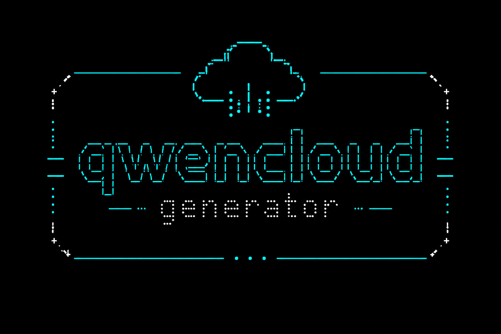

<p align="center">
  
</p>

<h1 align="center">QwenCloud Generator</h1>

<p align="center">
  🚀 Automated QwenCloud account registration & API key harvester with multi-threading, TUI dashboard, proxy rotation, and Gmail OAuth
</p>

<p align="center">
  <a href="#features">Features</a> •
  <a href="#prerequisites">Prerequisites</a> •
  <a href="#setup">Setup</a> •
  <a href="#usage">Usage</a> •
  <a href="#how-it-works">How It Works</a>
</p>

---

## Features

- ⚡ **Multi-threaded** — Run N browsers concurrently (`-t N`)
- 🖥️ **TUI Dashboard** — Real-time worker status, progress bar, ETA, CPU/Mem
- 👻 **Invisible mode** — Headed browser on Xvfb virtual display (CF-safe)
- 🔄 **Proxy rotation** — Each account gets a unique proxy, no reuse
- 📧 **Gmail OAuth** — Multi-account Gmail token management for email verification
- 🎭 **Censor mode** — Mask emails and API keys in output (`-c`)
- 🔄 **Auto-resume** — Login existing accounts to harvest missed API keys
- 📊 **Scenario detection** — Auto-detects all page states (signup, login, OTP, dashboard, etc.)

## Prerequisites

| Requirement | Install |
|---|---|
| Python 3.11+ | [python.org](https://python.org) |
| Google Chrome | [google.com/chrome](https://google.com/chrome) |
| Xvfb | `sudo apt install xvfb` |
| Playwright | `pip install -r requirements.txt && playwright install chromium` |

## Setup

### 1. Clone & install
```bash
git clone https://github.com/Vanszs/qwencloud-generator.git
cd qwencloud-generator
pip install -r requirements.txt
playwright install chromium
```

### 2. Add proxies
Edit `proxy.txt` — one proxy per line:
```
username:password@host:port
```

### 3. Generate email list
```bash
python3 generate_email_list.py yourgmailuser -o email_list.txt
```

### 4. Set up Gmail OAuth
1. Create a project at [Google Cloud Console](https://console.cloud.google.com/)
2. Enable **Gmail API**
3. Create **OAuth 2.0 credentials** (Desktop app type)
4. Download `client_secret.json` to this folder
5. Authorize each base Gmail account:
```bash
python3 gmail_auth.py
```

## Usage

### Register new accounts
```bash
# Single thread, browser visible
python3 run.py 10

# 5 threads, invisible (Xvfb)
python3 run.py 100 --headless -t 5

# 10 threads with censored output
python3 run.py 400 --headless -t 10 -c
```

### Resume existing accounts
```bash
python3 run.py 50 --headless -t 5 --resume
```

### Flags

| Flag | Description | Default |
|---|---|---|
| `N` | Target number of successful API keys | 5 |
| `--headless` | Run via Xvfb (invisible browser) | off |
| `--resume` | Resume already-registered accounts via login | off |
| `-t N` | Number of concurrent threads | 1 |
| `-c` | Censor emails/API keys in output | off |
| `--log` | Show full subprocess logs | off |
| `--self` | Run without proxy (use own IP) | off |
| `--nyx PROXY` | Use rotating proxy | — |

## How It Works

```
┌─────────────┐    ┌──────────────┐    ┌─────────────────┐
│  Email List  │───▶│  run.py      │───▶│ qwencloud_full.py│
│  (Gmail)     │    │  (Orchestrator)│    │  (Browser Auto)  │
└─────────────┘    │  -t N threads │    │  - Signup/Login   │
                   │  TUI Dashboard │    │  - OTP verify     │
┌─────────────┐    │  Proxy claim  │    │  - API key extract│
│  proxy.txt   │───▶│  Email claim  │    └─────────────────┘
└─────────────┘    └──────────────┘             │
                         │                      ▼
                   ┌──────────────┐      ┌─────────────┐
                   │  api_keys.txt│◀─────│ accounts.json│
                   └──────────────┘      └─────────────┘
```

1. Each thread claims a unique email + proxy (thread-safe)
2. Spawns `qwencloud_full.py` as subprocess (Playwright is not thread-safe)
3. Monitors subprocess output for progress updates → TUI
4. Parses `__RESULT__` JSON from stdout
5. Saves API keys to `api_keys.txt` and account data to `accounts.json`

## Files

| File | Purpose |
|---|---|
| `run.py` | Main orchestrator — threading, TUI, proxy/email claiming |
| `qwencloud_full.py` | Browser automation — signup, login, API key extraction |
| `gmail_auth.py` | Gmail OAuth multi-account token management |
| `generate_email_list.py` | Generate Gmail dot-variants |
| `logger.py` | Colored logging utilities |
| `tui.py` | Terminal UI dashboard (ANSI escape codes, no dependencies) |
| `run_hidden.sh` | Xvfb wrapper script |

## Notes

- Each browser instance gets 1 unique proxy — no reuse
- Gmail dot-variants work as separate QwenCloud accounts
- Stuck processes are killed after 30s of no output
- Total timeout per account: 300s
- Cloudflare requires headed browser (use `--headless` which runs Xvfb, not true headless)

## License

MIT — feel free to use, modify, and distribute.

---

<p align="center">
  <a href="https://github.com/Vanszs/qwencloud-generator">⭐ Star if useful</a>
</p>
